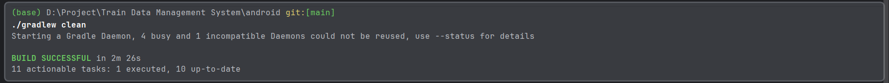

# 开发环境配置
## SDK下载

- [https://docs.flutter.dev/release/archive](https://docs.flutter.dev/release/archive)

## 新建项目

- [在 VS Code 里开发 Flutter 应用](https://docs.flutter.cn/tools/vs-code)

通过 Flutter 入门应用模板新建 Flutter 项目：

1. 打开 **View** > **Command Palette...**。你也可以按下 Ctrl / Cmd + Shift + P。
2. 输入 `flutter`。
3. 选择 **Flutter: New Project** 命令。第一次使用会提示配置SDK。
4. 按下 Enter。
5. 选择 **Application**。
6. 按下 Enter。
7. 选择 **项目地址**。
8. 输入你想要的 **项目名**。注意：项目名必须小写且不能有空格，空格用`_`代替。

这时出现了一个问题：创建Flutter项目卡住/卡死/无响应 - [解决方案](https://blog.csdn.net/weixin_46017976/article/details/114448696)
解决方案里的镜像源可用[其他的](https://docs.flutter.cn/community/china)
`[train_data_management_system] flutter create --template app --overwrite .` VScode会卡在这里，问了GPT说是
- **网络问题**： Flutter 在创建项目时可能需要下载一些依赖，如果网络不稳定或被防火墙阻止，可能会导致卡住。
- **Flutter SDK 问题**： Flutter SDK 本身可能有问题，或者没有正确安装或配置。
- **文件权限问题**： 如果在创建项目的目录中没有足够的权限，可能会导致创建过程卡住。

上述的解决方案没有解决，所以尝试使用*Android Studio*。要安装Flutter插件，才能创建Flutter项目，创建项目时，Generator要选择Flutter而不是Java，然后第一次要配置Flutter SDK。


Android Studio创建项目也会卡，尝试用命令行创建。
`CMD`也不行，但我灵机一现，尝试了管理员模式，`flutter doctor`成功了，果然不能装在C盘下，可能有文件权限问题。*重装位置之后一切都变好了 : )*

## Flutter doctor 

```
[!] Android toolchain - develop for Android devices (Android SDK version 35.0.0) • Android SDK at C:\Users\l1491\AppData\Local\Android\sdk X cmdline-tools component is missing Run `path/to/sdkmanager --install "cmdline-tools;latest"` See https://developer.android.com/studio/command-line for more details. X Android license status unknown. Run `flutter doctor --android-licenses` to accept the SDK licenses. See https://flutter.dev/docs/get-started/install/windows##android-setup for more details.
```
1. `setting`-> `SDK Tools` ->`SDK Command-line Tools` 安装

2. 在 `cmdline-tools/latest/bin`运行以下命令安装 `cmdline-tools`**：
	`sdkmanager --install "cmdline-tools;latest"`
	接受 Android SDK 许可证 `flutter doctor --android-licenses`按照提示接受所有许可证。


第二步可能会报错：
`C:\Users\l1491\AppData\Local\Android\Sdk\cmdline-tools\latest\bin>sdkmanager --install "cmdline-tools;latest" ERROR: JAVA_HOME is set to an invalid directory: D:\Project\setting\JDK\bin Please set the JAVA_HOME variable in your environment to match the location of your Java installation`

确保要安装了[Java](https://www.injdk.cn/?spm=a2c6h.12873639.article-detail.8.7dda70c41Hg0Ek)，且配置了`%JAVA_HOME%`的环境变量，`%JAVA_HOME%`只能到总目录，不能到`bin`，所以之后的配置为`%JAVA_HOME%\bin`，我们要确保`%JAVA_HOME`是对的，因为，我们要用的就是这个。


## 第一次运行

运行时间很长，卡在`Running Gradle task 'assembleDebug'...`
本以为是上面 Flutter doctor 那一部分的问题，解决后发现不是，又搜集了一些资料，找到了这篇[文章](https://stackoverflow.com/questions/59516408/flutter-app-stuck-at-running-gradle-task-assembledebug)，然后又进行尝试`.gradlew clean`结果下载`Downloading https://mirrors.aliyun.com/gradle/gradle-5.6.2-src.zip`一直下载不完，又改了`gradle-wrapper.properties`里的`distributionUrl=https://mirrors.aliyun.com/gradle/gradle-5.6.2-src.zip`改成国内源。又报错了，国内源的版本比较低，但报错信息里有`Unzipping C:\Users\l1491\.gradle\wrapper\dists\gradle-5.6.2-src\43orte2k6wu3roinyu8rrteol\gradle-5.6.2-src.zip`发现之前尝试的手动下载放错地方了，发现原来之前下成功过，只不过国外源太慢了。
**解决方案**：手动下载，并放到`.gradlew clean`生成的文件夹的地方，只用放压缩包即可，再次执行命令会自动解压。自此，这一部分终结。

之后重新运行命令，比之前好了，最后一个报错`Unsupported class file major version 66`，这表示你正在使用不兼容的Java版本：Gradle 7.6.3 支持 Java 8、Java 11、Java 17 和 Java 19。

最后没有报错了，执行命令但还是很慢，要等好久……

纪念历史性的一刻！！！


[最后还是配置了代理解决，速度是真的快](https://blog.csdn.net/wangzhongshun/article/details/104898953)

设置里同样配置，见下面的信息：
```c++
// gradle.properties
systemProp.https.proxyPort=7899  
systemProp.http.proxyHost=127.0.0.1  
systemProp.https.proxyHost=127.0.0.1  
systemProp.http.proxyPort=7899 //端口号是看了Clash里的Http端口号
```

成功运行，从运行日志发现，之前做的`Flutter doctor`并非没有用，一切都是有意义的~（~~既然已经代理了，那么之前所做的国内源替换就全都撤销了~~）
